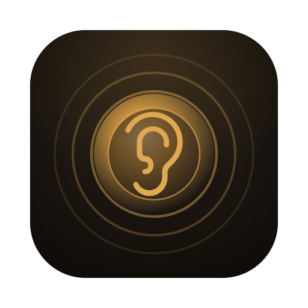
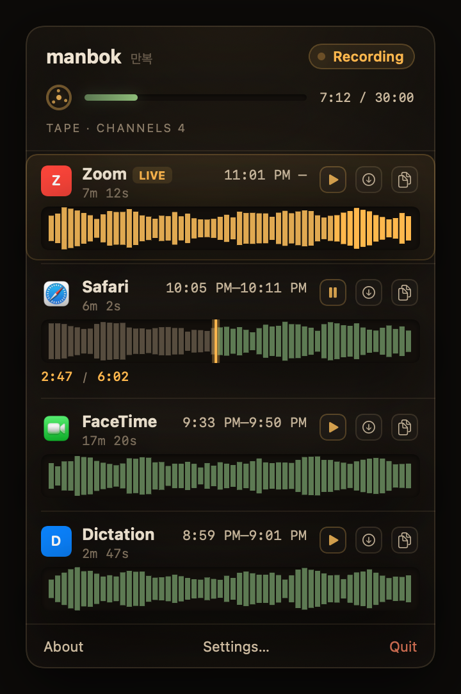
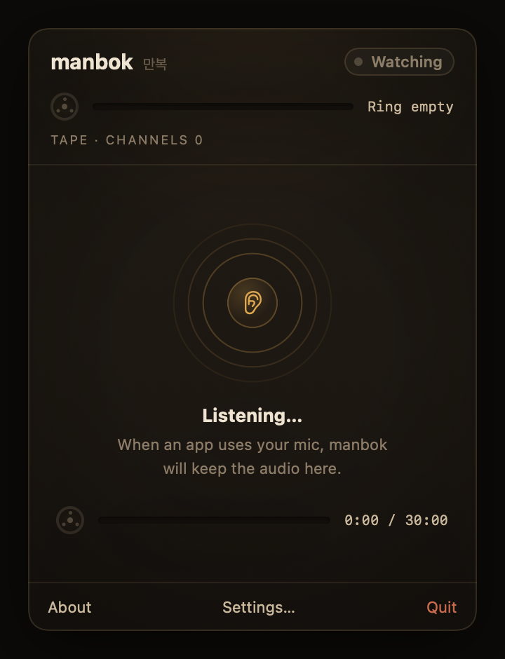
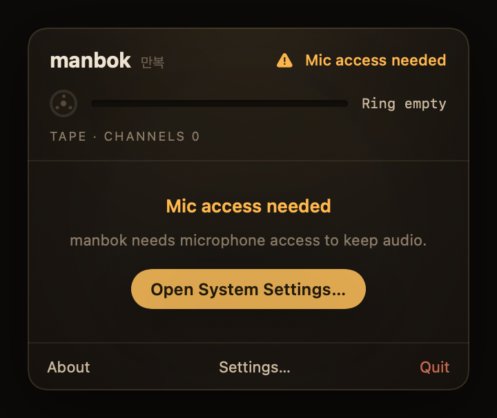

<p align="center">
  
</p>

# manbok

**Your dictation app just glitched and ate the sentence you spoke. manbok has it.**

manbok is a macOS menu bar app that keeps the last few minutes of microphone audio in RAM — automatically, whenever *any* app is using the mic. Speech-to-text dropped your words? Meeting app died mid-sentence? Open the popover, hit Dump, and the audio is back as a WAV. Nothing is ever written to disk unless you export it, and quitting wipes everything.

<p align="center">
  
</p>

## Install

**Requirements:** macOS 14+ (Sonoma), Apple Silicon, Xcode Command Line Tools (`xcode-select --install`).

### Prebuilt releases

Download from [Releases](https://github.com/madaboutcode/manbok/releases). The app is not yet notarized, so on first open macOS will warn that it can't verify the developer — right-click the app → **Open**, or allow it under **System Settings → Privacy & Security → Open Anyway**. Building from source (below) avoids this entirely.

### From source

```bash
git clone https://github.com/madaboutcode/manbok.git
cd manbok
make install-app            # build + assemble → ~/Applications/Manbok.app
```

Then open **Manbok.app** — the ear icon appears in your menu bar. Approve the microphone permission prompt on first launch.

### Start at login

Open the popover → Settings → check "Start at login."

### CLI (optional)

The CLI binary talks to the running app over a Unix socket:

```bash
make install                # release build → ~/.local/bin/manbok
```

If `~/.local/bin` isn't in your PATH:

```bash
echo 'export PATH="$HOME/.local/bin:$PATH"' >> ~/.zshrc && source ~/.zshrc
```

### Uninstall

Quit the app (popover → Quit), then:

```bash
rm -rf ~/Applications/Manbok.app
make uninstall              # remove CLI binary
```

## User guide

### The menu bar icon

| Icon | Meaning |
|------|---------|
| Ear (gray) | **Watching** — no app is using the mic |
| Ear + waves (red) | **Recording** — at least one app is using the mic |
| Ear + slash | **Mic access needed** — permission denied or revoked |

Click the icon to open the popover.

<p align="center">
  &nbsp;
</p>

### The popover

- **Header:** state badge + ring fill (e.g. "7:12 / 30:00")
- **Session list:** one row per app that used the mic, newest first. Each row shows the app name, time range, duration, and a waveform.
- **Export:** hover or focus a row to reveal **Dump** (saves WAV, reveals in Finder) and **Copy** (WAV to clipboard). Keyboard: arrows to navigate, Return = dump, Cmd+C = copy.
- **Footer:** About · Settings · Quit

### Settings

- **Buffer duration:** 5 / 10 (default) / 30 / 60 / 120 minutes. RAM cost shown beside each. Applies immediately — shrinking discards the oldest audio.
- **Start at login:** registers the app as a login item via macOS.

### CLI reference

The CLI is a thin client. `manbok start` opens the app; all other commands talk to it over the socket.

| Command | Description |
|---------|-------------|
| `manbok start` | Open Manbok.app (prints "already running" if it is) |
| `manbok start --foreground` | Debug: in-process daemon with terminal meter |
| `manbok stop` | Quit the app |
| `manbok status` | Phase + ring fill |
| `manbok sessions` | List sessions (stable ids, per-app) |
| `manbok dump` | Export newest session → WAV path on stdout |
| `manbok dump 1` | Export by stable session id |
| `manbok dump -1` | Previous session |
| `manbok dump all` | Full ring (no session framing) |
| `manbok dump --minutes 5` | Last N minutes of ring |
| `manbok dump --list` | Same as `sessions` |
| `manbok authorize` | Request mic permission (for debug/foreground use) |

State: `~/.manbok/` (pid + Unix socket). Logs: Console.app, subsystem `ai.manbok.app`.

## How it works

```
CLI (short-lived) ──IPC──► App (long-lived) ──► CaptureOrchestrator ──► AVAudioEngine ──► ring buffer
                              ├── PopoverViewModel ──► SwiftUI views
                              └── dump ──► temp WAV ──► Finder / clipboard
```

- **Audio:** mono 16 kHz, 16-bit PCM (~32 KB/s). Ring overwrites oldest data when full.
- **Opportunistic capture:** manbok never initiates mic use. Audio enters the ring only while another app holds the mic.
- **Per-app sessions:** each app that uses the mic gets its own session with a stable id. Overlapping sessions share the same audio (by design — they're views over one ring).
- **No audio on disk** until you explicitly export (Dump or Copy in the popover, `dump` in the CLI). Quitting discards everything.

## Development

```bash
git clone https://github.com/madaboutcode/manbok.git
cd manbok
make build                  # debug build (CLI)
make test                   # run tests (147 tests)
make verify                 # test + build
make app                    # build + assemble Manbok.app
make run-app                # build + open the app
make dev                    # build CLI, restart, foreground meter
```

### Project structure

| Module | What it owns |
|--------|-------------|
| `Sources/ManbokCore/` | Domain: ring buffer, sessions, waveform, IPC types. No frameworks. |
| `Sources/ManbokPlatform/` | macOS adapters: AVAudioEngine, sockets, files, settings, migration |
| `Sources/ManbokApp/` | SwiftUI app: MenuBarExtra, popover, settings window |
| `Sources/manbok/` | CLI: ArgumentParser subcommands, thin IPC client |

Each module has a `CLAUDE.md` with a jumpstart and layout table. Architecture: `ARCHITECTURE.md`.

### Make targets

| Target | What it does |
|--------|-------------|
| `make build` | Debug build (CLI) |
| `make release` | Release build (CLI) |
| `make test` | `swift test` |
| `make verify` | test + build |
| `make app` | Release build + assemble `Manbok.app` |
| `make install-app` | app → `~/Applications/Manbok.app` |
| `make run-app` | Build + `open Manbok.app` |
| `make install` | Release CLI → `~/.local/bin/manbok` |
| `make dev` | Build CLI, stop, start foreground meter |
| `make start-fg` | Foreground daemon with terminal meter |

All targets: `make help`

## Why "manbok"?

> *because Man-bok never misses a word*

Named after [**Jung Man-bok**](https://en.wikipedia.org/wiki/Crash_Landing_on_You#People_in_the_North_Korean_Forces) (정만복), the wiretapper in [*Crash Landing on You*](https://en.wikipedia.org/wiki/Crash_Landing_on_You) — always listening, never missing a word.

## Privacy

manbok is an always-on microphone buffer, so here is exactly what it does with audio:

- **Capture is opportunistic.** manbok never opens the microphone on its own. Audio enters the buffer only while *another* app is actively using the mic.
- **RAM only.** Audio lives in a fixed-size ring buffer in memory (5–120 minutes, your setting). Nothing is written to disk during capture.
- **Export is explicit.** A WAV file is created only when you click Dump/Copy or run `manbok dump`. Files go to the system temp directory (or your clipboard) — you decide where they end up after that.
- **Nothing leaves your machine.** There is no network code in this app. No telemetry, no analytics, no accounts.
- **Purge is instant.** Quit the app and the buffer is gone.

## License

[MIT](LICENSE) — do what you like; attribution appreciated.
